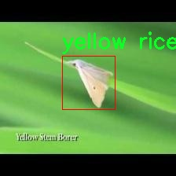

# 改进yolo11-ODConv等200+全套创新点大全：农作物害虫检测系统源码＆数据集全套

### 1.图片效果展示


##### 项目来源 **[人工智能促进会 2024.10.30](https://kdocs.cn/l/cszuIiCKVNis)**

注意：由于项目一直在更新迭代，上面“1.图片效果展示”和“2.视频效果展示”展示的系统图片或者视频可能为老版本，新版本在老版本的基础上升级如下：（实际效果以升级的新版本为准）

  （1）适配了YOLOV11的“目标检测”模型和“实例分割”模型，通过加载相应的权重（.pt）文件即可自适应加载模型。

  （2）支持“图片识别”、“视频识别”、“摄像头实时识别”三种识别模式。

  （3）支持“图片识别”、“视频识别”、“摄像头实时识别”三种识别结果保存导出，解决手动导出（容易卡顿出现爆内存）存在的问题，识别完自动保存结果并导出到tempDir中。

  （4）支持Web前端系统中的标题、背景图等自定义修改。

  另外本项目提供训练的数据集和训练教程,暂不提供权重文件（best.pt）,需要您按照教程进行训练后实现图片演示和Web前端界面演示的效果。

### 2.视频效果展示

[2.1 视频效果展示](https://www.bilibili.com/video/BV1pgSEYXEwn/)

### 3.背景

研究背景与意义

随着全球农业生产的不断发展，农作物害虫的监测与防治成为了保障粮食安全和提高农业产量的重要环节。传统的人工识别和监测方法不仅耗时耗力，而且容易受到主观因素的影响，导致识别准确率低下。近年来，计算机视觉和深度学习技术的迅猛发展为农作物害虫的自动检测提供了新的解决方案。其中，YOLO（You Only Look Once）系列模型因其高效的实时检测能力，逐渐成为农业害虫监测领域的研究热点。

本研究旨在基于改进的YOLOv11模型，构建一个高效的农作物害虫检测系统。该系统将针对多种农作物害虫进行实时监测，涵盖了包括军虫、豆类盲蝽、红蜘蛛、水稻虫、稻叶卷叶虫、稻叶蝉、水稻水象甲、小麦皮蝇、白背飞虱和黄稻螟等在内的十种主要害虫。这些害虫不仅对农作物造成直接的经济损失，还可能引发更广泛的生态问题，因此其早期检测和及时防治显得尤为重要。

在数据集方面，本研究使用了包含995张图像的害虫检测数据集，涵盖了多种害虫的不同形态和生长阶段。通过对这些数据的深入分析和处理，结合改进的YOLOv11模型，我们期望能够提高害虫检测的准确性和效率，从而为农民提供更为可靠的决策支持。此外，该系统的开发不仅具有重要的学术价值，也将为农业生产的智能化转型提供切实可行的技术支撑，推动农业可持续发展。因此，本研究在理论和实践层面均具有重要的意义。

### 4.数据集信息展示

##### 4.1 本项目数据集详细数据（类别数＆类别名）

nc: 10
names: ['army worm', 'legume blister beetle', 'red spider', 'rice gall midge', 'rice leaf roller', 'rice leafhopper', 'rice water weevil', 'wheat phloeothrips', 'white backed plant hopper', 'yellow rice borer']


该项目为【目标检测】数据集，请在【训练教程和Web端加载模型教程（第三步）】这一步的时候按照【目标检测】部分的教程来训练

##### 4.2 本项目数据集信息介绍

本项目数据集信息介绍

本项目旨在改进YOLOv11的农作物害虫检测系统，为此我们采用了名为“insects”的数据集。该数据集专门用于训练和评估模型在农作物害虫识别方面的性能，涵盖了十种不同类别的害虫。这些类别包括：军虫、豆类水蛭、红蜘蛛、水稻虫、稻叶卷虫、稻叶蝉、水稻水象甲、小麦木虱、白背飞虱以及黄稻螟。这些害虫在农业生产中对作物造成了严重威胁，因此准确识别和及时防治显得尤为重要。

“insects”数据集的构建基于大量的实地采集和标注，确保了数据的真实性和多样性。每一类害虫都经过专业人员的精确标注，数据集中包含了不同生长阶段、不同环境下的图像样本，极大地增强了模型的泛化能力。通过多样化的样本，模型能够更好地适应不同的光照条件、背景杂乱程度以及害虫的姿态变化，从而提高检测的准确性和鲁棒性。

在训练过程中，我们将利用这些高质量的标注数据，结合YOLOv11的先进特性，进行多轮迭代训练，以优化模型的参数和结构。通过不断调整学习率、批量大小等超参数，我们期望能够显著提升模型在害虫检测任务中的表现。此外，数据集中的图像样本将被分为训练集、验证集和测试集，以便全面评估模型的性能和实用性。

综上所述，“insects”数据集为本项目提供了坚实的数据基础，使得改进后的YOLOv11模型能够在农作物害虫检测领域发挥更大的作用，为农业生产的可持续发展提供技术支持。





### 5.全套项目环境部署视频教程（零基础手把手教学）

[5.1 所需软件PyCharm和Anaconda安装教程（第一步）](https://www.bilibili.com/video/BV1BoC1YCEKi/?spm_id_from=333.999.0.0&vd_source=bc9aec86d164b67a7004b996143742dc)


[5.2 安装Python虚拟环境创建和依赖库安装视频教程（第二步）](https://www.bilibili.com/video/BV1ZoC1YCEBw?spm_id_from=333.788.videopod.sections&vd_source=bc9aec86d164b67a7004b996143742dc)

### 6.改进YOLOv11训练教程和Web_UI前端加载模型教程（零基础手把手教学）

[6.1 改进YOLOv11训练教程和Web_UI前端加载模型教程（第三步）](https://www.bilibili.com/video/BV1BoC1YCEhR?spm_id_from=333.788.videopod.sections&vd_source=bc9aec86d164b67a7004b996143742dc)


按照上面的训练视频教程链接加载项目提供的数据集，运行train.py即可开始训练



     Epoch   gpu_mem       box       obj       cls    labels  img_size
     1/200     20.8G   0.01576   0.01955  0.007536        22      1280: 100%|██████████| 849/849 [14:42<00:00,  1.04s/it]
               Class     Images     Labels          P          R     mAP@.5 mAP@.5:.95: 100%|██████████| 213/213 [01:14<00:00,  2.87it/s]
                 all       3395      17314      0.994      0.957      0.0957      0.0843

     Epoch   gpu_mem       box       obj       cls    labels  img_size
     2/200     20.8G   0.01578   0.01923  0.007006        22      1280: 100%|██████████| 849/849 [14:44<00:00,  1.04s/it]
               Class     Images     Labels          P          R     mAP@.5 mAP@.5:.95: 100%|██████████| 213/213 [01:12<00:00,  2.95it/s]
                 all       3395      17314      0.996      0.956      0.0957      0.0845

     Epoch   gpu_mem       box       obj       cls    labels  img_size
     3/200     20.8G   0.01561    0.0191  0.006895        27      1280: 100%|██████████| 849/849 [10:56<00:00,  1.29it/s]
               Class     Images     Labels          P          R     mAP@.5 mAP@.5:.95: 100%|███████   | 187/213 [00:52<00:00,  4.04it/s]
                 all       3395      17314      0.996      0.957      0.0957      0.0845


###### [项目数据集下载链接](https://kdocs.cn/l/cszuIiCKVNis)

### 7.原始YOLOv11算法讲解


ultralytics发布了最新的作品YOLOv11，这一次YOLOv11的变化相对于ultralytics公司的上一代作品YOLOv8变化不是很大的（YOLOv9、YOLOv10均不是ultralytics公司作品），其中改变的位置涉及到C2f变为C3K2，在SPPF后面加了一层类似于注意力机制的C2PSA，还有一个变化大家从yaml文件是看不出来的就是它的检测头内部替换了两个DWConv，以及模型的深度和宽度参数进行了大幅度调整，但是在损失函数方面就没有变化还是采用的CIoU作为边界框回归损失，下面带大家深入理解一下ultralytics最新作品YOLOv11的创新点。

**下图为最近的YOLO系列发布时间线！**


* * *

###### YOLOv11和YOLOv8对比

在YOLOYOLOv5，YOLOv8，和YOLOv11是ultralytics公司作品（ultralytics出品必属精品），下面用一张图片从yaml文件来带大家对比一下YOLOv8和YOLOv11的区别，配置文件变得内容比较少大家可以看一卡，左侧为YOLOv8右侧为YOLOv11，不同的点我用黑线标注了出来。


* * *

###### YOLOv11的网络结构解析

下面的图片为YOLOv11的网络结构图。


**其中主要创新点可以总结如下- > **

* * *

1\.
提出C3k2机制，其中C3k2有参数为c3k，其中在网络的浅层c3k设置为False（下图中可以看到c3k2第二个参数被设置为False，就是对应的c3k参数）。


此时所谓的C3k2就相当于YOLOv8中的C2f，其网络结构为一致的，其中的C3k机制的网络结构图如下图所示
**（为什么叫C3k2，我个人理解是因为C3k的调用时C3k其中的参数N固定设置为2的原因，个人理解不一定对** ）。


* * *

2\.
第二个创新点是提出C2PSA机制，这是一个C2（C2f的前身）机制内部嵌入了一个多头注意力机制，在这个过程中我还发现作者尝试了C2fPSA机制但是估计效果不如C2PSA，有的时候机制有没有效果理论上真的很难解释通，下图为C2PSA机制的原理图，仔细观察把Attention哪里去掉则C2PSA机制就变为了C2所以我上面说C2PSA就是C2里面嵌入了一个PSA机制。


* * *

3\.
第三个创新点可以说是原先的解耦头中的分类检测头增加了两个DWConv，具体的对比大家可以看下面两个图下面的是YOLOv11的解耦头，上面的是YOLOv8的解耦头.


我们上面看到了在分类检测头中YOLOv11插入了两个DWConv这样的做法可以大幅度减少参数量和计算量（原先两个普通的Conv大家要注意到卷积和是由3变为了1的，这是形成了两个深度可分离Conv），大家可能不太理解为什么加入了两个DWConv还能够减少计算量，以及什么是深度可分离Conv，下面我来解释一下。

> **`DWConv` 代表 Depthwise
> Convolution（深度卷积）**，是一种在卷积神经网络中常用的高效卷积操作。它主要用于减少计算复杂度和参数量，尤其在移动端或轻量化网络（如
> MobileNet）中十分常见。
>
> **1\. 标准卷积的计算过程**
>
> 在标准卷积操作中，对于一个输入张量（通常是一个多通道的特征图），卷积核的尺寸是 `(h, w, C_in)`，其中 `h` 和 `w`
> 是卷积核的空间尺寸，`C_in`
> 是输入通道的数量。而卷积核与输入张量做的是完整的卷积运算，每个输出通道都与所有输入通道相连并参与卷积操作，导致计算量比较大。
>
> 标准卷积的计算过程是这样的：
>
>   * 每个输出通道是所有输入通道的组合（加权求和），卷积核在每个位置都会计算与所有输入通道的点积。
>   * 假设有 `C_in` 个输入通道和 `C_out` 个输出通道，那么卷积核的总参数量是 `C_in * C_out * h * w`。
>

>
> 2\. **Depthwise Convolution（DWConv）**
>
> 与标准卷积不同， **深度卷积** 将输入的每个通道单独处理，即 **每个通道都有自己的卷积核进行卷积**
> ，不与其他通道进行交互。它可以被看作是标准卷积的一部分，专注于空间维度上的卷积运算。
>
> **深度卷积的计算过程：**
>
>   * 假设输入张量有 `C_in` 个通道，每个通道会使用一个 `h × w`
> 的卷积核进行卷积操作。这个过程称为“深度卷积”，因为每个通道独立进行卷积运算。
>   * 输出的通道数与输入通道数一致，每个输出通道只和对应的输入通道进行卷积，没有跨通道的组合。
>   * 参数量和计算量相比标准卷积大大减少，卷积核的参数量是 `C_in * h * w`。
>

>
> **深度卷积的优点：**
>
>   1. **计算效率高** ：相对于标准卷积，深度卷积显著减少了计算量。它只处理空间维度上的卷积，不再处理通道间的卷积。
>   2.  **参数量减少** ：由于每个卷积核只对单个通道进行卷积，参数量大幅减少。例如，标准卷积的参数量为 `C_in * C_out * h *
> w`，而深度卷积的参数量为 `C_in * h * w`。
>   3.  **结合点卷积可提升效果** ：为了弥补深度卷积缺乏跨通道信息整合的问题，通常深度卷积后会配合 `1x1` 的点卷积（Pointwise
> Convolution）使用，通过 `1x1` 的卷积核整合跨通道的信息。这种组合被称为 **深度可分离卷积** （Depthwise
> Separable Convolution） | **这也是我们本文YOLOv11中的做法** 。
>

>
> 3\. **深度卷积与标准卷积的区别**
>
> 操作类型| 卷积核大小| 输入通道数| 输出通道数| 参数量  
> ---|---|---|---|---  
> 标准卷积| `h × w`| `C_in`| `C_out`| `C_in * C_out * h * w`  
> 深度卷积（DWConv）| `h × w`| `C_in`| `C_in`| `C_in * h * w`  
>  
> 可以看出，深度卷积在相同的卷积核大小下，参数量减少了约 `C_out` 倍
> （细心的人可以发现用最新版本的ultralytics仓库运行YOLOv8参数量相比于之前的YOLOv8以及大幅度减少了这就是因为检测头改了的原因但是名字还是Detect，所以如果你想继续用YOLOv8发表论文做实验那么不要更新最近的ultralytics仓库）。
>
> **4\. 深度可分离卷积 (Depthwise Separable Convolution)**
>
> 深度卷积常与 `1x1` 的点卷积配合使用，这称为深度可分离卷积。其过程如下：
>
>   1. 先对输入张量进行深度卷积，对每个通道独立进行空间卷积。
>   2. 然后通过 `1x1` 点卷积，对通道维度进行混合，整合不同通道的信息。
>

>
> 这样既可以保证计算量的减少，又可以保持跨通道的信息流动。
>
> 5\. **总结**
>
> `DWConv` 是一种高效的卷积方式，通过单独处理每个通道来减少计算量，结合 `1x1`
> 的点卷积，形成深度可分离卷积，可以在保持网络性能的同时极大地减少模型的计算复杂度和参数量。

**看到这里大家应该明白了为什么加入了两个DWConv还能减少参数量以及YOLOv11的检测头创新点在哪里。**

* * *

##### YOLOv11和YOLOv8还有一个不同的点就是其各个版本的模型（N - S - M- L - X）网络深度和宽度变了


可以看到在深度（depth）和宽度
（width）两个地方YOLOv8和YOLOv11是基本上完全不同了，这里我理解这么做的含义就是模型网络变小了，所以需要加深一些模型的放缩倍数来弥补模型之前丧失的能力从而来达到一个平衡。

> **本章总结：**
> YOLOv11的改进点其实并不多更多的都是一些小的结构上的创新，相对于之前的YOLOv5到YOLOv8的创新，其实YOLOv11的创新点不算多，但是其是ultralytics公司的出品，同时ultralytics仓库的使用量是非常多的（不像YOLOv9和YOLOv10）所以在未来的很长一段时间内其实YOLO系列估计不会再更新了，YOLOv11作为最新的SOTA肯定是十分适合大家来发表论文和创新的。
>

### 8.200+种全套改进YOLOV11创新点原理讲解

#### 8.1 200+种全套改进YOLOV11创新点原理讲解大全

由于篇幅限制，每个创新点的具体原理讲解就不全部展开，具体见下列网址中的改进模块对应项目的技术原理博客网址【Blog】（创新点均为模块化搭建，原理适配YOLOv5~YOLOv11等各种版本）

[改进模块技术原理博客【Blog】网址链接](https://gitee.com/qunmasj/good)


#### 8.2 精选部分改进YOLOV11创新点原理讲解

###### 这里节选部分改进创新点展开原理讲解(完整的改进原理见上图和[改进模块技术原理博客链接](https://gitee.com/qunmasj/good)【如果此小节的图加载失败可以通过CSDN或者Github搜索该博客的标题访问原始博客，原始博客图片显示正常】

### ParC融合位置感知循环卷积简介
ParC：Position aware circular convolution


#### Position aware circular convolution
针对于全局信息的提取作者提出了Position aware circular convolution（也称作Global Circular Convolution）。图中左右实际是对于该操作水平竖直两方向的对称，理解时只看左边即可。对于维度为C*H*W的输入，作者先将维度为C*B*1的Position Embedding通过双线性插值函数F调整到适合input的维度C*H*1（以适应不同特征大小输入），并且将PE水平复制扩展到C*H*W维度与输入特征相加。这里作者将PE直接设置成为了可学习的参数。

接下来参考该博客将加入PE的特征图竖直方向堆叠，并且同样以插值的方式得到了适应输入维度的C*H*1大小的卷积核，进行卷积操作。对于这一步卷积，作者将之称为循环卷积，并给出了一个卷积示意图。


但个人感觉实际上这个示意图只是为了说明为什么叫循环卷积，对于具体的计算细节还是根据公式理解更好。


进一步，作者给出了这一步的伪代码来便于读者对这一卷积的理解：y=F.conv2D（torch.cat（xp，xp，dim=2），kV），实际上就是将xp堆叠之后使用了一个“条形（或柱形）”卷积核进行简单的卷积操作。（但这样会导致多一次重复卷积，因此在堆叠示意图中只取了前2*H-1行）

可以看到在示意图中特征维度变化如下：C*(2H-1)*W ---C*H*1--->C*H*W，作者特意带上了通道数，并且并没有出现通道数的改变，那么这里所进行的卷积应该是depth wise卷积，通过对文章后续以及论文源码的阅读可以得知这一步进行的就是DW卷积。（we introduce group convolution and point wise convolution into these modules, which decreases number of parameters without hurting performance.）


由groups = channel可知使用的是DW卷积
通过上面就完成了一次竖直方向的全局信息交流，同样只要在水平方向进行同样的操作即可做到水平方向的全局信息交流。

#### ParC block

通过ParC成功解决了全局信息提取的问题，接下来就是针对2）3）两点进行改进。首先是Meta-Former模块，Meta-Former由Token Mixer和Channel Mixer构成，ParC首先满足了Token Mixer的全局信息提取的要求，并且相较于Attention在计算成本上更低。


这里①中的PWC即point wise conv，进一步验证了我们前面对于深度可分离卷积的想法，而GCC-H/V即是前面所说的ParC-H/V。

①构建了Meta-Former中的Token mixer模块，那么最后剩下的问题就是3），替换掉Attention模块之后模型不再data driven。为了解决这一点作者给出了一个channel wise attention，先将特征图（x,C*H*W）进行global average（a,C*1*1）并输入一个MLP生成一个channel wise的权重（w,C*1*1），再将权重与特征图在通道方向相乘得到输出（output = wx,C*H*W）。

#### ParC net
对于ParC net 的搭建，作者直接基于MobileViT，采用了分叉结构（c）完成了网络的搭建。


具体而言作者保留了MobileViT中浅层具有局部感受野的MobileNetV2结构，而将网络深层的ViT block替换成了ParC block，使网络变成了一个pure ConvNet。


### 9.系统功能展示

图9.1.系统支持检测结果表格显示

  图9.2.系统支持置信度和IOU阈值手动调节

  图9.3.系统支持自定义加载权重文件best.pt(需要你通过步骤5中训练获得)

  图9.4.系统支持摄像头实时识别

  图9.5.系统支持图片识别

  图9.6.系统支持视频识别

  图9.7.系统支持识别结果文件自动保存

  图9.8.系统支持Excel导出检测结果数据


### 10. YOLOv11核心改进源码讲解

#### 10.1 block.py

以下是对您提供的代码进行逐文件分析后的核心部分，包含详细的中文注释。由于代码量较大，我将只保留一些关键的类和函数，并对其进行注释。

```python
import torch
import torch.nn as nn
import torch.nn.functional as F

def autopad(k, p=None, d=1):
    """自动填充以保持输出形状相同"""
    if d > 1:
        k = d * (k - 1) + 1 if isinstance(k, int) else [d * (x - 1) + 1 for x in k]  # 实际的卷积核大小
    if p is None:
        p = k // 2 if isinstance(k, int) else [x // 2 for x in k]  # 自动填充
    return p

class Conv(nn.Module):
    """卷积层，包含卷积、批归一化和激活函数"""
    def __init__(self, in_channels, out_channels, kernel_size=3, stride=1, padding=None, groups=1, act=True):
        super(Conv, self).__init__()
        self.conv = nn.Conv2d(in_channels, out_channels, kernel_size, stride, autopad(kernel_size, padding), groups=groups, bias=False)
        self.bn = nn.BatchNorm2d(out_channels)
        self.act = nn.SiLU() if act else nn.Identity()  # 使用SiLU激活函数

    def forward(self, x):
        return self.act(self.bn(self.conv(x)))  # 前向传播

class Bottleneck(nn.Module):
    """标准瓶颈模块，包含两个卷积层"""
    def __init__(self, c1, c2, shortcut=True, g=1, k=(3, 3), e=0.5):
        super(Bottleneck, self).__init__()
        c_ = int(c2 * e)  # 隐藏通道数
        self.cv1 = Conv(c1, c_, k[0], 1)  # 第一个卷积层
        self.cv2 = Conv(c_, c2, k[1], 1)  # 第二个卷积层
        self.add = shortcut and c1 == c2  # 是否使用shortcut连接

    def forward(self, x):
        """前向传播，使用shortcut连接"""
        return x + self.cv2(self.cv1(x)) if self.add else self.cv2(self.cv1(x))

class C3k(nn.Module):
    """C3k模块，包含多个瓶颈模块"""
    def __init__(self, c1, c2, n=1, shortcut=False, g=1, e=0.5, k=3):
        super(C3k, self).__init__()
        self.m = nn.Sequential(*(Bottleneck(c1, c2, shortcut, g, k=(k, k), e=e) for _ in range(n)))  # 创建n个瓶颈模块

    def forward(self, x):
        return self.m(x)  # 前向传播

class DynamicConv(nn.Module):
    """动态卷积层"""
    def __init__(self, c1, c2, k=1, s=1, p=None, g=1, d=1, act=True, num_experts=4):
        super().__init__()
        self.conv = nn.Sequential(
            DynamicConv_Single(c1, c2, kernel_size=k, stride=s, padding=autopad(k, p, d), dilation=d, groups=g, num_experts=num_experts),
            nn.BatchNorm2d(c2),
            nn.SiLU() if act else nn.Identity()
        )

    def forward(self, x):
        return self.conv(x)  # 前向传播

class C3k_DynamicConv(C3k):
    """C3k模块，使用动态卷积"""
    def __init__(self, c1, c2, n=1, shortcut=False, g=1, e=0.5, k=3):
        super().__init__(c1, c2, n, shortcut, g, e, k)
        c_ = int(c2 * e)  # 隐藏通道数
        self.m = nn.Sequential(*(Bottleneck_DynamicConv(c_, c_, shortcut, g, k=(k, k), e=1.0) for _ in range(n)))  # 创建n个动态卷积瓶颈模块

class C3k2_DynamicConv(C3k2):
    """C3k2模块，使用动态卷积"""
    def __init__(self, c1, c2, n=1, c3k=False, e=0.5, g=1, shortcut=True):
        super().__init__(c1, c2, n, c3k, e, g, shortcut)
        self.m = nn.ModuleList(C3k_DynamicConv(self.c, self.c, 2, shortcut, g) if c3k else Bottleneck_DynamicConv(self.c, self.c, shortcut, g, k=(3, 3), e=1.0) for _ in range(n))

# 其他类和函数省略，您可以根据需要进行添加和注释

```

以上是代码的核心部分，包含了卷积层、瓶颈模块、动态卷积模块以及C3k和C3k2模块的定义。每个类和函数都附有详细的中文注释，帮助理解其功能和实现方式。请根据需要选择添加更多的类和函数注释。

这个 `block.py` 文件是一个深度学习模型的实现，主要用于构建各种卷积块和注意力机制，以便在图像处理任务中使用。文件中包含了多个类和函数，每个类或函数都有其特定的功能。以下是对文件内容的逐步分析和说明。

首先，文件导入了一些必要的库，包括 PyTorch、NumPy 以及其他自定义模块。接着，定义了一些通用的工具函数，例如 `autopad` 用于自动计算卷积的填充，`make_divisible` 用于确保通道数是可被特定数整除的。

接下来，文件中定义了多个卷积块和注意力机制的类。比如 `swish`、`h_swish` 和 `h_sigmoid` 是一些激活函数的实现，`DyReLU` 是一种动态激活函数，能够根据输入的特征自适应调整。

`DyHeadBlock` 和 `DyHeadBlockWithDCNV3` 是动态头部块的实现，主要用于处理特征图并进行卷积操作，支持不同的归一化层和激活函数。`Fusion` 类则实现了特征融合的功能，可以根据不同的融合策略（如加权、拼接等）来合并多个输入特征图。

`Partial_conv3` 和 `Faster_Block` 类实现了部分卷积和快速块的功能，主要用于在卷积操作中引入一些灵活性和效率。`C3k_Faster` 和 `C3k2_Faster` 是基于这些块构建的更复杂的结构，通常用于更深层次的网络。

`DCNv2` 和 `DCNv3` 类实现了可变形卷积，能够根据输入特征自适应调整卷积核的位置，增强模型对几何变换的鲁棒性。

文件中还定义了许多与注意力机制相关的类，如 `ChannelAttention_HSFPN`、`SMA` 和 `SMAFormerBlock`，这些类通过不同的方式增强了特征图的表达能力。

此外，文件中还有一些与特征融合、上下文信息提取相关的模块，如 `ContextGuideFusionModule` 和 `PyramidContextExtraction`，这些模块能够有效地整合不同层次的特征信息。

最后，文件还包含了一些特定于 YOLO 和其他目标检测模型的实现，结合了多种卷积和注意力机制，以提高检测精度和速度。

总的来说，`block.py` 文件实现了一个复杂的深度学习模块，包含了多种卷积块、注意力机制和特征融合策略，适用于各种计算机视觉任务，尤其是目标检测和图像分割等。每个类和函数都为构建高效的神经网络提供了基础组件。

#### 10.2 mamba_vss.py

以下是代码中最核心的部分，并附上详细的中文注释：

```python
import torch
import torch.nn as nn
import torch.nn.functional as F

class SS2D(nn.Module):
    def __init__(self, d_model, d_state=16, d_conv=3, expand=2, dropout=0., bias=False, device=None, dtype=None):
        super().__init__()
        # 初始化模型参数
        self.d_model = d_model  # 输入特征维度
        self.d_state = d_state  # 状态维度
        self.d_conv = d_conv  # 卷积核大小
        self.expand = expand  # 扩展因子
        self.d_inner = int(self.expand * self.d_model)  # 内部特征维度
        factory_kwargs = {"device": device, "dtype": dtype}

        # 输入线性变换
        self.in_proj = nn.Linear(self.d_model, self.d_inner * 2, bias=bias, **factory_kwargs)
        
        # 卷积层
        self.conv2d = nn.Conv2d(
            in_channels=self.d_inner,
            out_channels=self.d_inner,
            groups=self.d_inner,
            bias=True,
            kernel_size=d_conv,
            padding=(d_conv - 1) // 2,
            **factory_kwargs,
        )
        
        self.act = nn.SiLU()  # 激活函数

        # 状态和时间步长的线性变换
        self.x_proj_weight = nn.Parameter(torch.empty(4, self.d_inner, self.d_state * 2))  # 权重参数
        self.dt_projs_weight = nn.Parameter(torch.empty(4, self.d_inner, self.d_state))  # 时间步长权重
        self.dt_projs_bias = nn.Parameter(torch.empty(4, self.d_inner))  # 时间步长偏置
        
        # 初始化状态和时间步长
        self.A_logs = self.A_log_init(self.d_state, self.d_inner)  # 状态初始化
        self.Ds = self.D_init(self.d_inner)  # D参数初始化

        self.out_norm = nn.LayerNorm(self.d_inner)  # 输出归一化
        self.out_proj = nn.Linear(self.d_inner, self.d_model, bias=bias, **factory_kwargs)  # 输出线性变换
        self.dropout = nn.Dropout(dropout) if dropout > 0. else None  # Dropout层

    def forward(self, x: torch.Tensor):
        # 前向传播
        B, H, W, C = x.shape  # 获取输入的批次大小、高度、宽度和通道数

        # 输入线性变换
        xz = self.in_proj(x)
        x, z = xz.chunk(2, dim=-1)  # 将输入分为x和z

        x = x.permute(0, 3, 1, 2).contiguous()  # 调整维度顺序
        x = self.act(self.conv2d(x))  # 卷积和激活
        y = self.forward_core(x)  # 核心前向传播
        y = y * F.silu(z)  # 与z进行逐元素相乘
        out = self.out_proj(y)  # 输出线性变换
        if self.dropout is not None:
            out = self.dropout(out)  # 应用Dropout
        return out

    def forward_core(self, x: torch.Tensor):
        # 核心前向传播逻辑
        B, C, H, W = x.shape
        L = H * W  # 计算总的空间维度
        K = 4  # 复制次数

        # 处理输入
        x_hwwh = torch.stack([x.view(B, -1, L), torch.transpose(x, dim0=2, dim1=3).contiguous().view(B, -1, L)], dim=1).view(B, 2, -1, L)
        xs = torch.cat([x_hwwh, torch.flip(x_hwwh, dims=[-1])], dim=1)  # 处理后的输入

        # 线性变换
        x_dbl = torch.einsum("b k d l, k c d -> b k c l", xs.view(B, K, -1, L), self.x_proj_weight)
        dts, Bs, Cs = torch.split(x_dbl, [self.dt_rank, self.d_state, self.d_state], dim=2)  # 分割线性变换结果

        # 计算输出
        out_y = self.selective_scan(xs, dts, self.A_logs, Bs, Cs, self.Ds)  # 选择性扫描
        y = out_y.view(B, K, -1, L)  # 调整输出维度
        y = self.out_norm(y)  # 归一化输出

        return y

class VSSBlock(nn.Module):
    def __init__(self, hidden_dim: int = 0, drop_path: float = 0.2):
        super().__init__()
        self.ln_1 = nn.LayerNorm(hidden_dim)  # 归一化层
        self.self_attention = SS2D(d_model=hidden_dim)  # 自注意力层
        self.drop_path = nn.Dropout(drop_path)  # DropPath层

    def forward(self, input: torch.Tensor):
        input = input.permute((0, 2, 3, 1))  # 调整输入维度
        x = input + self.drop_path(self.self_attention(self.ln_1(input)))  # 计算自注意力并加上残差连接
        return x.permute((0, 3, 1, 2))  # 调整输出维度

# 主程序部分用于测试模型
if __name__ == '__main__':
    inputs = torch.randn((1, 64, 32, 32)).cuda()  # 随机生成输入
    model = VSSBlock(64).cuda()  # 实例化模型
    pred = model(inputs)  # 前向传播
    print(pred.size())  # 输出预测结果的尺寸
```

### 代码说明：
1. **SS2D类**：这是一个自定义的神经网络模块，包含输入线性变换、卷积层、激活函数和核心前向传播逻辑。它的主要功能是处理输入数据并生成输出特征。
2. **VSSBlock类**：这是一个包含自注意力机制的模块，使用了SS2D类作为自注意力层，并添加了归一化和DropPath功能。
3. **forward方法**：实现了模型的前向传播逻辑，主要包括输入处理、特征提取和输出生成。
4. **主程序部分**：用于测试模型的功能，生成随机输入并输出模型的预测结果。

这个程序文件 `mamba_vss.py` 实现了两个神经网络模块：`VSSBlock` 和 `Mamba2Block`，它们都是基于 PyTorch 框架构建的。文件中还定义了一个名为 `SS2D` 的类，它是实现这些模块的核心部分。以下是对代码的详细说明。

首先，文件导入了必要的库，包括 PyTorch、数学库、Einops（用于张量重排）、以及一些自定义的模块和函数。接着，定义了 `SS2D` 类，它是一个继承自 `nn.Module` 的神经网络模块，主要用于处理输入数据并进行特征提取。

在 `SS2D` 的构造函数中，初始化了一些参数，如模型维度 `d_model`、状态维度 `d_state`、卷积核大小 `d_conv` 等。接着，创建了一些神经网络层，包括线性层和卷积层。特别地，`in_proj` 是一个线性层，用于将输入数据投影到更高维度；`conv2d` 是一个深度可分离卷积层，用于对特征进行卷积操作。

在 `SS2D` 中还定义了一些静态方法，用于初始化特定的参数，例如 `dt_init` 用于初始化时间步长的投影，`A_log_init` 和 `D_init` 用于初始化模型中的矩阵参数。这些初始化方法确保模型在训练开始时具有良好的性能。

`forward_corev0` 方法是 `SS2D` 的核心前向传播逻辑。它使用选择性扫描（`selective_scan_fn`）对输入数据进行处理，提取特征并生成输出。此方法涉及到对输入张量的多次变换和操作，包括张量的重排、分割和矩阵乘法等。

`forward` 方法是 `SS2D` 的前向传播接口，接受输入张量并经过一系列处理后返回输出。它首先通过 `in_proj` 层进行线性变换，然后经过卷积层和核心前向传播逻辑，最后通过输出层进行映射。

接下来，定义了 `VSSBlock` 类，它同样继承自 `nn.Module`。在构造函数中，初始化了层归一化、`SS2D` 自注意力模块和 DropPath。`forward` 方法实现了输入数据的前向传播，通过自注意力模块进行特征提取，并结合残差连接。

最后，`Mamba2Block` 类继承自 `VSSBlock`，并重写了自注意力模块为 `Mamba2Simple`。它的前向传播方法与 `VSSBlock` 类似，但在处理输入时进行了适当的调整。

在文件的最后部分，提供了一个简单的测试代码，创建了随机输入并实例化了 `VSSBlock` 和 `Mamba2Block`，然后打印出它们的输出尺寸。这部分代码用于验证模型的基本功能和输出形状是否符合预期。

总体来说，这个程序文件实现了一个复杂的自注意力机制模块，适用于深度学习模型中的特征提取任务，尤其是在处理图像数据时。

#### 10.3 val.py

以下是经过简化和注释的核心代码部分：

```python
import os
import torch
from ultralytics.engine.validator import BaseValidator
from ultralytics.utils.metrics import DetMetrics, box_iou
from ultralytics.utils.plotting import output_to_target, plot_images

class DetectionValidator(BaseValidator):
    """
    扩展自BaseValidator类的检测模型验证器。
    """

    def __init__(self, dataloader=None, save_dir=None, args=None):
        """初始化检测模型，设置必要的变量和参数。"""
        super().__init__(dataloader, save_dir, args)
        self.metrics = DetMetrics(save_dir=self.save_dir)  # 初始化检测指标
        self.iouv = torch.linspace(0.5, 0.95, 10)  # 定义IOU阈值范围
        self.niou = self.iouv.numel()  # IOU的数量

    def preprocess(self, batch):
        """对输入图像批次进行预处理。"""
        # 将图像转移到设备上并进行归一化处理
        batch["img"] = batch["img"].to(self.device, non_blocking=True) / 255
        # 将其他数据转移到设备上
        for k in ["batch_idx", "cls", "bboxes"]:
            batch[k] = batch[k].to(self.device)
        return batch

    def postprocess(self, preds):
        """对预测结果应用非极大值抑制（NMS）。"""
        return ops.non_max_suppression(
            preds,
            self.args.conf,
            self.args.iou,
            multi_label=True,
            max_det=self.args.max_det,
        )

    def update_metrics(self, preds, batch):
        """更新检测指标。"""
        for si, pred in enumerate(preds):
            npr = len(pred)  # 当前预测的数量
            pbatch = self._prepare_batch(si, batch)  # 准备当前批次数据
            cls, bbox = pbatch.pop("cls"), pbatch.pop("bbox")  # 获取真实标签
            if npr == 0:
                continue  # 如果没有预测，跳过

            # 处理预测
            predn = self._prepare_pred(pred, pbatch)  # 准备预测数据
            stat = {"conf": predn[:, 4], "pred_cls": predn[:, 5]}  # 记录置信度和类别

            # 计算正确预测
            if len(cls):
                stat["tp"] = self._process_batch(predn, bbox, cls)  # 计算真阳性
            # 将统计信息添加到指标中
            for k in self.stats.keys():
                self.stats[k].append(stat[k])

    def get_stats(self):
        """返回指标统计信息和结果字典。"""
        stats = {k: torch.cat(v, 0).cpu().numpy() for k, v in self.stats.items()}  # 转换为numpy数组
        if len(stats) and stats["tp"].any():
            self.metrics.process(**stats)  # 处理指标
        return self.metrics.results_dict  # 返回结果字典

    def plot_predictions(self, batch, preds, ni):
        """在输入图像上绘制预测的边界框并保存结果。"""
        plot_images(
            batch["img"],
            *output_to_target(preds),
            paths=batch["im_file"],
            fname=self.save_dir / f"val_batch{ni}_pred.jpg",
            names=self.names,
        )

    def _process_batch(self, detections, gt_bboxes, gt_cls):
        """
        返回正确预测矩阵。

        参数:
            detections (torch.Tensor): 预测结果，格式为[x1, y1, x2, y2, conf, class]。
            gt_bboxes (torch.Tensor): 真实标签的边界框。
            gt_cls (torch.Tensor): 真实标签的类别。

        返回:
            (torch.Tensor): 正确预测矩阵。
        """
        iou = box_iou(gt_bboxes, detections[:, :4])  # 计算IOU
        return self.match_predictions(detections[:, 5], gt_cls, iou)  # 匹配预测与真实标签
```

### 代码说明：
1. **DetectionValidator类**：这是一个用于YOLO模型验证的类，继承自`BaseValidator`。它主要负责处理验证过程中的数据预处理、后处理、指标更新等功能。
   
2. **初始化方法**：在初始化时，设置了检测指标、IOU阈值等参数。

3. **预处理方法**：将输入图像批次转移到指定设备，并进行归一化处理。

4. **后处理方法**：应用非极大值抑制（NMS）来过滤掉重叠的预测框。

5. **更新指标方法**：在每个批次中更新检测指标，包括真阳性、置信度和预测类别。

6. **获取统计信息方法**：返回当前的指标统计信息和结果字典。

7. **绘制预测结果方法**：在输入图像上绘制预测的边界框并保存结果。

8. **处理批次方法**：计算预测结果与真实标签之间的匹配，返回正确预测的矩阵。

这个程序文件 `val.py` 是一个用于目标检测模型验证的类，继承自 `BaseValidator`。它主要用于在给定的数据集上评估 YOLO（You Only Look Once）模型的性能。程序中使用了 PyTorch 框架，并引入了多个辅助模块来处理数据加载、度量计算和结果可视化等任务。

在类的初始化方法中，设置了一些基本参数和变量，包括数据加载器、保存目录、进度条、参数字典等。它还定义了一些与 COCO 数据集相关的变量，如 `is_coco` 和 `class_map`，并初始化了一些度量指标，比如 `DetMetrics` 和 `ConfusionMatrix`。

`preprocess` 方法用于对输入的图像批次进行预处理，包括将图像转换为合适的格式和大小，并将标签和边界框数据移动到指定的设备上（如 GPU）。如果设置了混合保存模式，它还会准备自动标注所需的数据。

`init_metrics` 方法用于初始化评估指标，检查数据集是否为 COCO 格式，并根据模型的类别名称设置相关参数。

`get_desc` 方法返回一个格式化的字符串，用于总结 YOLO 模型的类别指标。

`postprocess` 方法对模型的预测结果应用非极大值抑制（NMS），以减少重叠的边界框。

`_prepare_batch` 和 `_prepare_pred` 方法分别用于准备输入批次和预测结果，以便进行后续的评估。

`update_metrics` 方法负责更新度量指标，处理每个预测结果并与真实标签进行比较。它会计算正确预测的数量，并在需要时更新混淆矩阵。

`finalize_metrics` 方法在所有批次处理完成后设置最终的度量值。

`get_stats` 方法返回度量统计信息和结果字典，计算每个类别的目标数量。

`print_results` 方法打印训练或验证集的每个类别的指标，包括图像数量、实例数量和各类指标的平均值。

`_process_batch` 方法计算正确预测矩阵，返回与真实边界框的交并比（IoU）匹配的预测结果。

`build_dataset` 和 `get_dataloader` 方法用于构建数据集和返回数据加载器，支持不同的批次大小和数据增强。

`plot_val_samples` 和 `plot_predictions` 方法用于可视化验证图像和预测结果，生成相应的图像文件。

`save_one_txt` 方法将 YOLO 检测结果保存为文本文件，采用特定的格式。

`pred_to_json` 方法将 YOLO 的预测结果序列化为 COCO JSON 格式，便于后续评估。

`eval_json` 方法用于评估 YOLO 输出的 JSON 格式结果，并返回性能统计信息，使用 pycocotools 库计算 mAP（平均精度均值）。

整体而言，这个程序文件实现了一个完整的目标检测模型验证流程，涵盖了数据预处理、模型评估、结果保存和可视化等多个方面。

#### 10.4 wtconv2d.py

以下是代码中最核心的部分，并附上详细的中文注释：

```python
import torch
import torch.nn as nn
import torch.nn.functional as F
from torch.autograd import Function
import pywt

# 创建小波滤波器
def create_wavelet_filter(wave, in_size, out_size, type=torch.float):
    # 创建小波对象
    w = pywt.Wavelet(wave)
    # 获取小波的高通和低通滤波器，并反转
    dec_hi = torch.tensor(w.dec_hi[::-1], dtype=type)
    dec_lo = torch.tensor(w.dec_lo[::-1], dtype=type)
    
    # 创建分解滤波器
    dec_filters = torch.stack([
        dec_lo.unsqueeze(0) * dec_lo.unsqueeze(1),  # LL
        dec_lo.unsqueeze(0) * dec_hi.unsqueeze(1),  # LH
        dec_hi.unsqueeze(0) * dec_lo.unsqueeze(1),  # HL
        dec_hi.unsqueeze(0) * dec_hi.unsqueeze(1)   # HH
    ], dim=0)

    # 重复滤波器以适应输入通道数
    dec_filters = dec_filters[:, None].repeat(in_size, 1, 1, 1)

    # 获取重构滤波器
    rec_hi = torch.tensor(w.rec_hi[::-1], dtype=type).flip(dims=[0])
    rec_lo = torch.tensor(w.rec_lo[::-1], dtype=type).flip(dims=[0])
    rec_filters = torch.stack([
        rec_lo.unsqueeze(0) * rec_lo.unsqueeze(1),  # LL
        rec_lo.unsqueeze(0) * rec_hi.unsqueeze(1),  # LH
        rec_hi.unsqueeze(0) * rec_lo.unsqueeze(1),  # HL
        rec_hi.unsqueeze(0) * rec_hi.unsqueeze(1)   # HH
    ], dim=0)

    # 重复滤波器以适应输出通道数
    rec_filters = rec_filters[:, None].repeat(out_size, 1, 1, 1)

    return dec_filters, rec_filters

# 小波变换
def wavelet_transform(x, filters):
    b, c, h, w = x.shape  # 获取输入的形状
    pad = (filters.shape[2] // 2 - 1, filters.shape[3] // 2 - 1)  # 计算填充
    # 使用卷积进行小波变换
    x = F.conv2d(x, filters.to(x.dtype).to(x.device), stride=2, groups=c, padding=pad)
    x = x.reshape(b, c, 4, h // 2, w // 2)  # 重塑输出形状
    return x

# 逆小波变换
def inverse_wavelet_transform(x, filters):
    b, c, _, h_half, w_half = x.shape  # 获取输入的形状
    pad = (filters.shape[2] // 2 - 1, filters.shape[3] // 2 - 1)  # 计算填充
    x = x.reshape(b, c * 4, h_half, w_half)  # 重塑输入形状
    # 使用转置卷积进行逆小波变换
    x = F.conv_transpose2d(x, filters.to(x.dtype).to(x.device), stride=2, groups=c, padding=pad)
    return x

# 定义小波变换的函数
class WaveletTransform(Function):
    @staticmethod
    def forward(ctx, input, filters):
        ctx.filters = filters  # 保存滤波器
        with torch.no_grad():
            x = wavelet_transform(input, filters)  # 进行小波变换
        return x

    @staticmethod
    def backward(ctx, grad_output):
        grad = inverse_wavelet_transform(grad_output, ctx.filters)  # 计算梯度
        return grad, None

# 定义逆小波变换的函数
class InverseWaveletTransform(Function):
    @staticmethod
    def forward(ctx, input, filters):
        ctx.filters = filters  # 保存滤波器
        with torch.no_grad():
            x = inverse_wavelet_transform(input, filters)  # 进行逆小波变换
        return x

    @staticmethod
    def backward(ctx, grad_output):
        grad = wavelet_transform(grad_output, ctx.filters)  # 计算梯度
        return grad, None

# 定义小波卷积层
class WTConv2d(nn.Module):
    def __init__(self, in_channels, out_channels, kernel_size=5, stride=1, bias=True, wt_levels=1, wt_type='db1'):
        super(WTConv2d, self).__init__()

        assert in_channels == out_channels  # 输入和输出通道数必须相同

        self.in_channels = in_channels
        self.wt_levels = wt_levels
        self.stride = stride

        # 创建小波滤波器
        self.wt_filter, self.iwt_filter = create_wavelet_filter(wt_type, in_channels, in_channels, torch.float)
        self.wt_filter = nn.Parameter(self.wt_filter, requires_grad=False)  # 小波滤波器
        self.iwt_filter = nn.Parameter(self.iwt_filter, requires_grad=False)  # 逆小波滤波器
        
        # 初始化小波变换和逆小波变换函数
        self.wt_function = wavelet_transform_init(self.wt_filter)
        self.iwt_function = inverse_wavelet_transform_init(self.iwt_filter)

        # 基础卷积层
        self.base_conv = nn.Conv2d(in_channels, in_channels, kernel_size, padding='same', stride=1, groups=in_channels, bias=bias)

        # 小波卷积层
        self.wavelet_convs = nn.ModuleList(
            [nn.Conv2d(in_channels*4, in_channels*4, kernel_size, padding='same', stride=1, groups=in_channels*4, bias=False) for _ in range(self.wt_levels)]
        )

    def forward(self, x):
        # 前向传播
        x_ll_in_levels = []  # 存储低频分量
        x_h_in_levels = []   # 存储高频分量

        curr_x_ll = x  # 当前低频分量

        # 小波变换过程
        for i in range(self.wt_levels):
            curr_x = self.wt_function(curr_x_ll)  # 进行小波变换
            curr_x_ll = curr_x[:,:,0,:,:]  # 获取低频分量
            
            # 处理小波卷积
            curr_x_tag = curr_x.reshape(curr_x.shape[0], curr_x.shape[1] * 4, curr_x.shape[3], curr_x.shape[4])
            curr_x_tag = self.wavelet_convs[i](curr_x_tag)  # 小波卷积
            x_ll_in_levels.append(curr_x_tag[:,:,0,:,:])  # 存储低频分量
            x_h_in_levels.append(curr_x_tag[:,:,1:4,:,:])  # 存储高频分量

        # 逆小波变换过程
        next_x_ll = 0
        for i in range(self.wt_levels-1, -1, -1):
            curr_x_ll = x_ll_in_levels.pop()  # 获取低频分量
            curr_x_h = x_h_in_levels.pop()  # 获取高频分量
            curr_x = torch.cat([curr_x_ll.unsqueeze(2), curr_x_h], dim=2)  # 合并低频和高频分量
            next_x_ll = self.iwt_function(curr_x)  # 进行逆小波变换

        x = self.base_conv(x) + next_x_ll  # 加上基础卷积的输出
        return x

# 定义缩放模块
class _ScaleModule(nn.Module):
    def __init__(self, dims, init_scale=1.0):
        super(_ScaleModule, self).__init__()
        self.weight = nn.Parameter(torch.ones(*dims) * init_scale)  # 初始化缩放权重
    
    def forward(self, x):
        return torch.mul(self.weight, x)  # 进行缩放
```

### 代码核心部分说明：
1. **小波滤波器创建**：`create_wavelet_filter` 函数用于生成小波变换和逆变换所需的滤波器。
2. **小波变换与逆变换**：`wavelet_transform` 和 `inverse_wavelet_transform` 函数分别实现小波变换和逆变换的具体操作。
3. **自定义函数**：`WaveletTransform` 和 `InverseWaveletTransform` 类实现了小波变换和逆变换的前向和反向传播。
4. **小波卷积层**：`WTConv2d` 类实现了小波卷积层，结合了小波变换和卷积操作。
5. **缩放模块**：`_ScaleModule` 类用于对输入进行缩放操作，增强模型的灵活性。

这个程序文件`wtconv2d.py`实现了一个基于小波变换的二维卷积层，主要用于图像处理和特征提取。程序中使用了PyTorch库来构建神经网络模型，并结合了小波变换的数学原理。以下是对代码的详细讲解。

首先，程序导入了必要的库，包括PyTorch的核心模块和小波变换的库`pywt`。接着，定义了一个名为`create_wavelet_filter`的函数，用于生成小波变换和逆小波变换所需的滤波器。这个函数接受小波类型、输入通道数和输出通道数作为参数，并返回相应的滤波器。

`wavelet_transform`和`inverse_wavelet_transform`函数实现了小波变换和逆小波变换的具体操作。它们通过对输入张量进行卷积操作来提取特征，并使用转置卷积来重建图像。

接下来，定义了两个类`WaveletTransform`和`InverseWaveletTransform`，它们继承自`torch.autograd.Function`。这两个类实现了小波变换和逆小波变换的前向和反向传播方法，使得它们可以在神经网络中使用。

`wavelet_transform_init`和`inverse_wavelet_transform_init`函数用于初始化小波变换和逆小波变换的应用函数，方便在模型中调用。

核心的`WTConv2d`类继承自`nn.Module`，实现了自定义的卷积层。构造函数中，首先验证输入和输出通道数相等。然后，创建小波滤波器并将其设为不可训练的参数。接着，定义了基础卷积层和小波卷积层，并使用`_ScaleModule`类来进行尺度调整。

在`forward`方法中，首先进行小波变换，提取低频和高频特征。然后，通过多个小波卷积层对提取的特征进行处理。接着，进行逆小波变换以重建图像。最后，将基础卷积的输出与小波变换的输出相加，得到最终的输出结果。

`_ScaleModule`类是一个简单的模块，用于对输入进行缩放操作。它通过一个可训练的权重参数来调整输入的尺度。

整体而言，这个程序实现了一个结合小波变换的卷积神经网络层，能够在图像处理任务中提取多尺度特征，并通过小波变换提高模型的表现。

注意：由于此博客编辑较早，上面“10.YOLOv11核心改进源码讲解”中部分代码可能会优化升级，仅供参考学习，以“11.完整训练+Web前端界面+200+种全套创新点源码、数据集获取”的内容为准。

### 11.完整训练+Web前端界面+200+种全套创新点源码、数据集获取


# [下载链接：https://mbd.pub/o/bread/Zp6Zk59q](https://mbd.pub/o/bread/Zp6Zk59q)